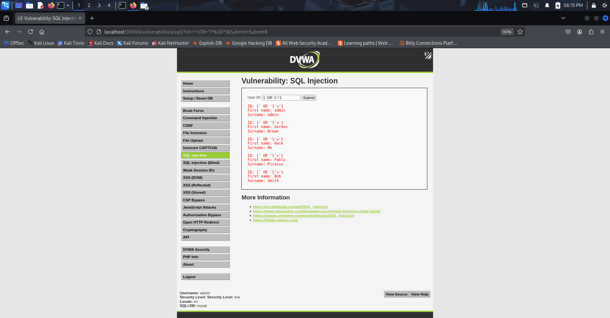
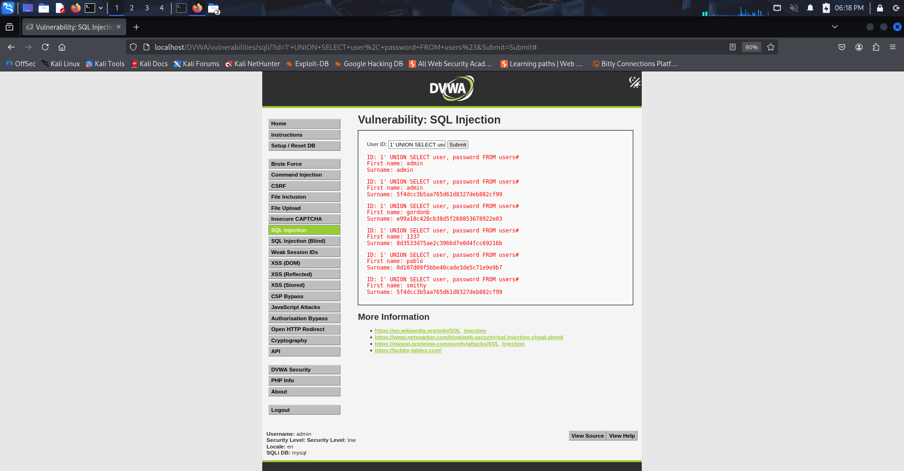
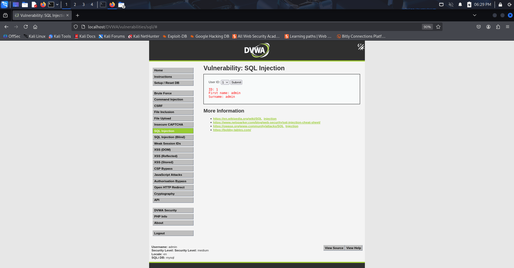
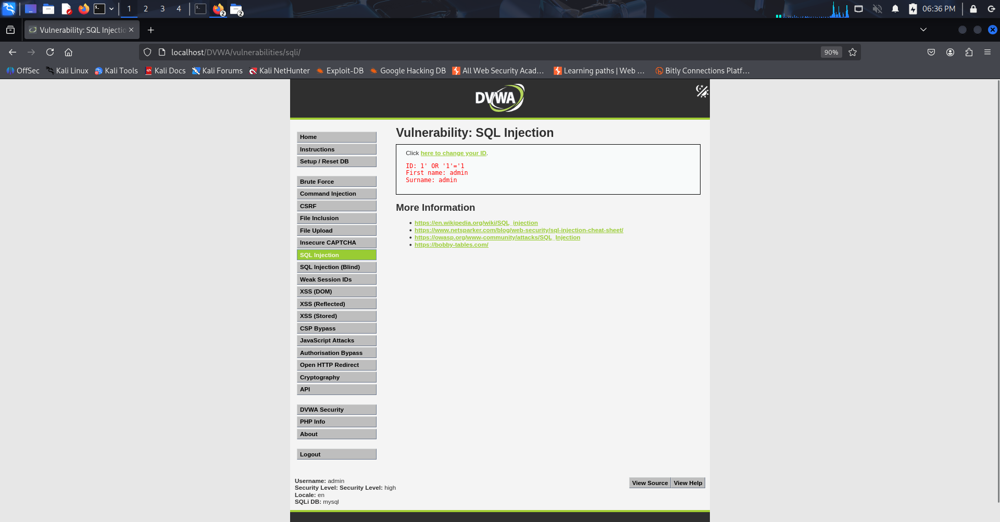

# 15-darn-sql-injection

This project demonstrates **SQL Injection vulnerabilities** using the intentionally vulnerable web application Damn Vulnerable Web Application (DVWA), The lab explores how SQL injection behaves under different security configurations (Low, Medium, and High).

The purpose of this task is to understand how attackers exploit insecure database queries and how security controls affect the exploitation process.

Tools and Technologies Used

DVWA (Damn Vulnerable Web Application)
Apache Web Server
MariaDB Database Server
Kali Linux
Web Browser (Firefox/Chrome)

What is SQL Injection?

SQL Injection is a web security vulnerability that allows an attacker to manipulate SQL queries executed by a database.

It occurs when user input is improperly validated or sanitized and directly included in database queries.

Example of a vulnerable query:

```
SELECT first_name, last_name 
FROM users 
WHERE user_id = '$id';
```

If the application does not validate the input properly, an attacker can inject malicious SQL code.

Example malicious input:

```
1' OR '1'='1
```

This modifies the SQL query logic so the condition always evaluates to TRUE allowing unauthorized access to database records.

---

# Lab Environment Setup

The lab was conducted using DVWA installed on Kali Linux with the following components:

* Apache Web Server
* MariaDB Database
* PHP modules required for DVWA

DVWA was accessed through:

```
http://localhost/DVWA
```

The database was initialized using the Create / Reset Database option in the DVWA setup page.

Default login credentials used:

```
Username: admin
Password: password
```

---

SQL Injection Lab

The SQL Injection module in DVWA was tested under three security levels:

* Low
* Medium
* High

Each level demonstrates different levels of protection against injection attacks.

---

# 1. Low Security Level

Objective

To exploit a basic SQL injection vulnerability with no input filtering.

### Steps

1. Login to DVWA.
2. Navigate to **DVWA Security**.
3. Set security level to **Low**.
4. Navigate to **SQL Injection** module.

Payload Used

```
1' OR '1'='1
```

Explanation

The payload modifies the SQL query as follows:

```
SELECT first_name, last_name 
FROM users 
WHERE user_id = '1' OR '1'='1';
```

Since `'1'='1'` is always true, the database returns all user records.

Result

Multiple user records were displayed including:

* admin
* Gordon Brown
* Hack Me
* Pablo Picasso
* Bob Smith

screenshot




---

2. Medium Security Level

Objective

To observe how SQL injection behaves with partial input validation.

Steps

1. Navigate to DVWA Security
2. Set security level to Medium
3. Open SQL Injection module.

At this level, the input field is replaced with a dropdown menu, restricting direct user input.

Observation

The application limits the user to selecting predefined IDs from a dropdown list.

However, the backend query still processes user-controlled input.

Result

The application returns user information for the selected ID.

Example result:

```
First name: admin
Surname: admin
```

Screenshot



---

3. High Security Level

Objective

To analyze SQL injection behavior when stronger protections are implemented.

Steps

1. Navigate to DVWA Security
2. Set security level to High
3. Open SQL Injection module.
4. Click "Click here to change ID"

A pop-up window appears for entering the user ID.

Payload Used

```
1' OR '1'='1
```

Result

Unlike the Low level, the application returned only one record:

```
First name: admin
Surname: admin
```

Explanation

At High security level:

* Input validation is stronger
* SQL queries are more controlled
* The injection is partially mitigated

Although the vulnerability still exists, the impact is reduced.

Screenshot



---

Impact of SQL Injection

SQL Injection vulnerabilities can lead to severe security consequences including:

* Unauthorized database access
* Data leakage
* Authentication bypass
* Data manipulation
* Complete database compromise

---

Prevention Techniques

To prevent SQL Injection vulnerabilities, developers should implement the following security practices:

1. Prepared Statements (Parameterized Queries)

Use prepared statements instead of dynamic SQL queries.

2. Input Validation

Validate and sanitize all user inputs.

3. Least Privilege Principle

Database accounts should have minimal required permissions.

4. Web Application Firewalls

Deploy security mechanisms to detect and block malicious inputs.

5. Secure Coding Practices

Follow secure coding standards during development.

---

Conclusion

This lab demonstrated how SQL Injection vulnerabilities can be exploited in web applications with weak input validation. By testing the vulnerability across different DVWA security levels, we observed how security mechanisms influence the exploitation process.

Understanding these vulnerabilities helps security professionals identify and mitigate risks in real-world web applications.
